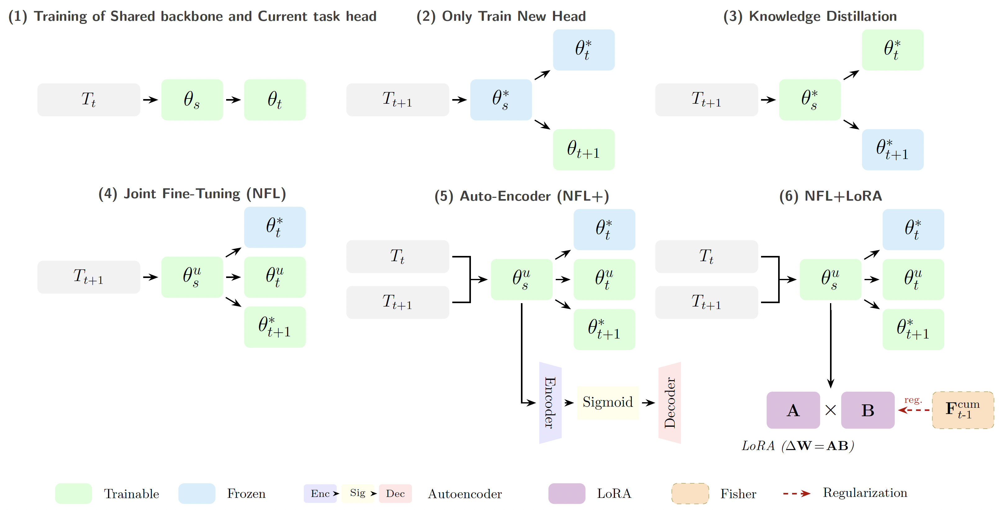
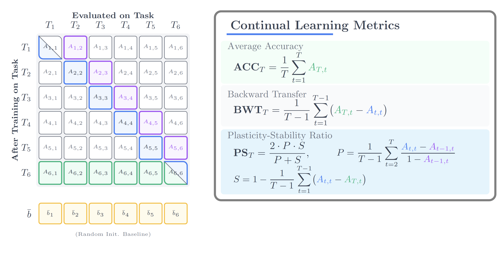

---

<div align="left">


# NFL: No Forgetting Learning
### A buffer-free approach to continual learning that actually works.

[](https://www.python.org/downloads/)
[](https://pytorch.org/)
[](LICENSE)

<br/>



</div>

## 📖 What's this about?

Most continual learning methods cheat a little — they keep a buffer of old examples around to remind the model what it learned before. That works, but it doesn't scale (memory grows with every task), and it's a non-starter when you can't store old data (think GDPR, medical records, anything privacy-sensitive).

We asked: **what if the network already has everything it needs?**

Overparameterized networks are full of redundancy. Instead of pruning it away, we repurpose it. NFL freezes and unfreezes different parts of the network in a specific sequence — isolating new learning, adapting shared features under distillation, then consolidating everything. No replay buffer. No growing memory. Just the network itself.

---

## 🧠 Design Philosophy

We hypothesize that by carefully orchestrating which parameters are updated at each training stage, the network's spare capacity can be used to stabilize learning rather than being pruned or overwritten. We decompose the network into three components: the shared backbone $\theta_s$, the old task head $\theta_t$, and the new task head $\theta_{t+1}$. 

Each component is either trained ($T$) or frozen ($F$), yielding $2^3 = 8$ possible configurations. We analyzed all eight to identify which are useful:

| # | $\theta_s$ | $\theta_t$ | $\theta_{t+1}$ | Outcome |
|:---:|:---:|:---:|:---:|---|
| 1 | $F$ | $F$ | $F$ | No learning occurs. |
| 2 | $T$ | $F$ | $F$ | Backbone drifts without head adaptation; features misalign. |
| 3 | $F$ | $T$ | $F$ | Old head re-fits on fixed features; no benefit for new task. |
| 4 | $F$ | $T$ | $T$ | Heads update on a frozen backbone; insufficient plasticity. |
| 5 | $T$ | $F$ | $T$ | Gradients from $\theta_{t+1}$ alter features needed by frozen $\theta_t$; directly causes forgetting. |
| **6** | **$F$** | **$F$** | **$T$** | **Safe initialization of the new head on existing features.** |
| **7** | **$T$** | **$T$** | **$F$** | **Controlled backbone adaptation anchored by old-task distillation.** |
| **8** | **$T$** | **$T$** | **$T$** | **Joint fine-tuning for global alignment; requires distillation safeguards.** |

Configurations 1–5 are suboptimal. The remaining three (**#6, #7, #8**) form the basis of our stepwise freezing pipeline. Crucially, their ordering matters: applying #8 first would let the new task dominate the shared representation, while starting with #6 ensures the new head is initialized without corrupting existing features. 

### The Pipeline Sequence:
* **Step 1:** Train the model on the current task $T_t$ using standard cross-entropy.
* **Step 2 (#6):** Freeze the backbone and old head, training only the new head $\theta_{t+1}$. This initializes the new classification capability without propagating noisy gradients into the backbone, addressing the failure mode identified in configuration #5.
* **Step 3 (#7):** Freeze the new head and update the backbone and old head. With the new head frozen, the update is guided by distillation from the old task, ensuring features adapt only in directions compatible with previous decision boundaries.
* **Step 4 (#8):** Unfreeze all components for joint fine-tuning, stabilized by two sets of soft targets that anchor the representation to both the original and intermediate models.

---

## 🛠️ Model Variants

**Three variants, one core idea:**

| Model | Backbone | What it adds |
|---|---|---|
| **NFL** | ResNet-18 | Stepwise freezing + dual knowledge distillation |
| **NFL+** | ResNet-18 | + Auto-Encoder for feature preservation + bias correction |
| **NFL+LoRA** | ViT-B/16 | + Low-rank adaptation + Fisher regularization |

* **NFL+** adds an Auto-Encoder after Step 1 to compress the old-task feature manifold, then uses it for bias correction in the final step.
* **NFL+LoRA** keeps the same 4-step logic but confines all ViT updates to low-rank matrices ($A$, $B$). After each task: estimate Fisher $\rightarrow$ accumulate $\rightarrow$ merge LoRA into base weights $\rightarrow$ reinitialize. Memory stays constant no matter how many tasks you train.

---

## 📊 Key Results

NFL+ uses **2.53%** of the buffer storage that replay methods need, and still closes most of the performance gap.

**ImageNet-1000, 10 tasks (Class-Incremental Learning):**

| Method | ACC (%) | Buffer Requirements |
|---|---|---|
| DyTox | 40.15 | 20K exemplars |
| MEMO | 38.90 | 20K exemplars |
| **NFL+ (ours)** | **38.42** | **None (0 exemplars)** |
| DCNet | 37.80 | None |
| LwF | 11.24 | None |

**ViT-B/16 on ImageNet-A, 20 tasks (Class-Incremental Learning):**

| Method | ACC (%) | Backward Transfer (BWT) |
|---|---|---|
| **NFL+LoRA (ours)** | **59.10** | **−0.08** |
| EWC-LoRA | 55.20 | −0.46 |
| CL-LoRA | 52.80 | −0.55 |

> *Full tables with all datasets, task counts, and detailed metrics are available in our [paper](#citation).*

---

## 📈 The Plasticity-Stability (PS) Metric

We propose a **Plasticity-Stability score** — the harmonic mean of how well the model learns new tasks (plasticity) and how well it retains old ones (stability). While Accuracy (ACC) shows average performance and Backward Transfer (BWT) shows forgetting, the PS score reveals the *balance*, which is critical for real-world deployment.

$$PS = \frac{2 \cdot P \cdot S}{P + S}$$

Where Plasticity ($P$) and Stability ($S$) are defined as:

$$P = \frac{1}{T-1} \sum_{k=2}^{T} \frac{A_{k,k} - A_{k-1,k}}{1 - A_{k-1,k}}$$

$$S = 1 - \frac{1}{T-1} \sum_{k=1}^{T-1} (A_{k,k} - A_{T,k})$$

(Note: $A_{i,j}$ represents the accuracy on task $j$ after training on task $i$, and $T$ is the total number of tasks).


---

## 📚 Citation

If you find this work useful in your research, please consider citing:
```bibtex
@misc{vahedifar2025forgettinglearningmemoryfreecontinual,
      title={No Forgetting Learning: Memory-free Continual Learning}, 
      author={Mohammad Ali Vahedifar and Qi Zhang},
      year={2025},
      eprint={2503.04638},
      archivePrefix={arXiv},
      primaryClass={cs.LG},
      url={[https://arxiv.org/abs/2503.04638](https://arxiv.org/abs/2503.04638)}, 
}
```

---

<div align="left">

**Questions? Issues? [Open a GitHub issue](../../issues).**

Built with PyTorch. Tested on NVIDIA A6000.

</div>
